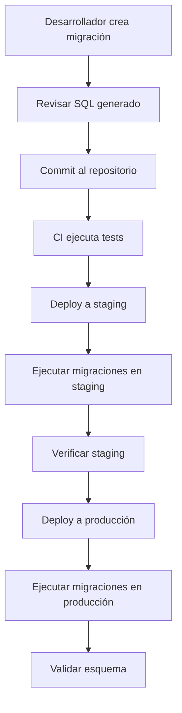

# Manual de Operación — Mantenimiento

[← Anterior: Troubleshooting](05-troubleshooting.md) | [Índice](../README.md)

---

## Mantenimiento Rutinario

### Tareas periódicas

| Tarea | Frecuencia | Comando |
|-------|-----------|---------|
| Limpiar caché ORM | En cada deploy | `php bin/console sybase:cache:clear` |
| Regenerar proxies | En cada deploy | `php bin/console sybase:proxy:generate` |
| Validar esquema | Semanal / post-deploy | `php bin/console sybase:schema:validate` |
| Rotar logs | Diario (automático) | Configurar logrotate |
| Verificar conexiones | En health checks | Endpoint `/health/database` |

## Migraciones en Producción

### Flujo seguro de migraciones



### Buenas prácticas para migraciones

1. **Nunca generar en producción**: Solo ejecutar migraciones que ya pasaron por staging
2. **Revisión obligatoria**: Todo SQL generado debe ser revisado antes del merge
3. **Migraciones atómicas**: Cada migración debe ser independiente y reversible conceptualmente
4. **Backup previo**: Siempre respaldar la base de datos antes de migrar en producción
5. **Ventana de mantenimiento**: Para migraciones destructivas (DROP, ALTER TABLE con lock), programar ventana

### Ejecutar en producción

```bash
# 1. Backup
# (usar herramientas de Sybase ASE)
# DUMP DATABASE production TO '/backups/pre-migration-20240115.dmp'

# 2. Ejecutar migraciones
php bin/console sybase:migrations:migrate --env=prod

# 3. Validar
php bin/console sybase:schema:validate --env=prod
```

### Si una migración falla

1. **No intentar arreglar en caliente** — analizar primero
2. **Verificar estado** de la base de datos
3. **Aplicar fix manual** si es necesario (SQL directo)
4. **Marcar migración como ejecutada** si se arregló manualmente

## Backup de Configuración

### Archivos a respaldar

| Archivo | Descripción | Crítico |
|---------|-------------|---------|
| `config/packages/sybase_orm.yaml` | Configuración del bundle | ✅ |
| `.env.local` / `.env.prod.local` | Variables de entorno locales | ✅ |
| `sybase_ase/migrations/` | Historial de migraciones | ✅ |
| `/etc/freetds/freetds.conf` | Configuración FreeTDS | ✅ |
| `config/packages/prod/` | Config específica de producción | ✅ |

### Script de backup

```bash
#!/bin/bash
BACKUP_DIR="/backups/config/$(date +%Y%m%d)"
mkdir -p "$BACKUP_DIR"

# Archivos de configuración
cp config/packages/sybase_orm.yaml "$BACKUP_DIR/"
cp .env.local "$BACKUP_DIR/" 2>/dev/null
cp -r config/packages/prod/ "$BACKUP_DIR/prod_config/"

# Migraciones
cp -r sybase_ase/migrations/ "$BACKUP_DIR/migrations/"

# FreeTDS
cp /etc/freetds/freetds.conf "$BACKUP_DIR/"

echo "Backup completado en: $BACKUP_DIR"
```

## Actualización del Bundle

### Verificar compatibilidad

Antes de actualizar, revisa el changelog y las breaking changes:

```bash
# Ver versión actual
composer show shedeza/sybase-orm-bundle | grep versions

# Ver versiones disponibles
composer outdated shedeza/sybase-orm-bundle
```

### Proceso de actualización

```bash
# 1. Leer CHANGELOG y notas de release

# 2. Actualizar en desarrollo
composer update shedeza/sybase-orm-bundle

# 3. Ejecutar tests
vendor/bin/phpunit

# 4. Verificar que la app funciona
php bin/console sybase:schema:validate

# 5. Commit y deploy normal
```

### Actualización major (breaking changes)

Para actualizaciones major (e.g., de v2.x a v3.x):

1. Leer la guía de migración completa
2. Crear una rama de actualización
3. Aplicar cambios de breaking changes uno por uno
4. Ejecutar la suite completa de tests
5. Testear en staging antes de producción

## Gestión de Caché en Producción

### Cuándo limpiar la caché

| Situación | Limpiar caché ORM | Limpiar caché Symfony |
|-----------|--------------------|-----------------------|
| Deploy normal | ✅ | ✅ |
| Cambios directos en BD | ✅ | ❌ |
| Cambio de configuración | ✅ | ✅ |
| Problemas de datos stale | ✅ | ❌ |
| Actualización del bundle | ✅ | ✅ |

### Caché Redis: mantenimiento

```bash
# Verificar uso de memoria
redis-cli INFO memory | grep used_memory_human

# Ver keys del ORM
redis-cli KEYS "sybase_orm:*" | head -20

# Limpiar solo keys del ORM
redis-cli KEYS "sybase_orm:*" | xargs redis-cli DEL

# Flush completo (cuidado: limpia TODA la caché)
redis-cli FLUSHDB
```

## Monitorización de Salud

### Script de health check

```bash
#!/bin/bash
# health-check.sh - ejecutar vía cron cada 5 minutos

RESULT=$(php /var/www/current/bin/console sybase:schema:validate --env=prod 2>&1)
EXIT_CODE=$?

if [ $EXIT_CODE -ne 0 ]; then
    echo "ALERT: Sybase ORM schema validation failed at $(date)" | \
        mail -s "DB Schema Alert" ops@company.com
    echo "$RESULT" | mail -s "DB Schema Alert - Details" ops@company.com
fi
```

### Cron para mantenimiento automático

```cron
# /etc/cron.d/sybase-orm-maintenance

# Verificar esquema cada 6 horas
0 */6 * * * www-data cd /var/www/current && php bin/console sybase:schema:validate --env=prod > /dev/null 2>&1 || echo "Schema validation failed" | logger -t sybase-orm

# Rotar logs de Sybase ORM diariamente
0 2 * * * root logrotate /etc/logrotate.d/sybase-orm
```

### Logrotate config

```
# /etc/logrotate.d/sybase-orm
/var/www/current/var/log/sybase.log {
    daily
    rotate 14
    compress
    delaycompress
    missingok
    notifempty
    create 0644 www-data www-data
}
```

## Limpieza de Archivos Temporales

```bash
# Limpiar proxies obsoletos (después de actualizar entidades)
rm -rf var/cache/prod/sybase_orm/proxies/*
php bin/console sybase:proxy:generate --env=prod

# Limpiar archivos de caché Symfony
php bin/console cache:clear --env=prod
```

## Checklist de Mantenimiento Mensual

- [ ] Verificar que los backups de configuración están actualizados
- [ ] Revisar logs de errores de Sybase ORM del último mes
- [ ] Verificar uso de memoria Redis (si aplica)
- [ ] Ejecutar `schema:validate` para confirmar consistencia
- [ ] Revisar si hay actualizaciones disponibles del bundle
- [ ] Verificar que las migraciones están sincronizadas entre entornos
- [ ] Limpiar migraciones antiguas ya aplicadas en todos los entornos (opcional)
- [ ] Verificar conectividad de health checks

---

[← Anterior: Troubleshooting](05-troubleshooting.md) | [Índice](../README.md)
