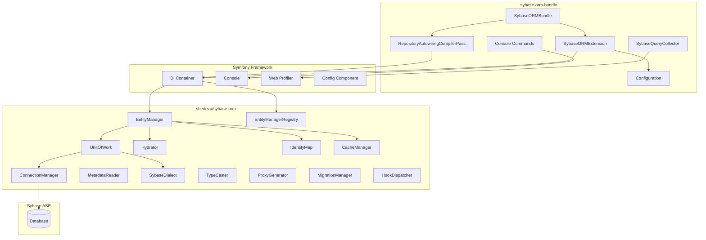
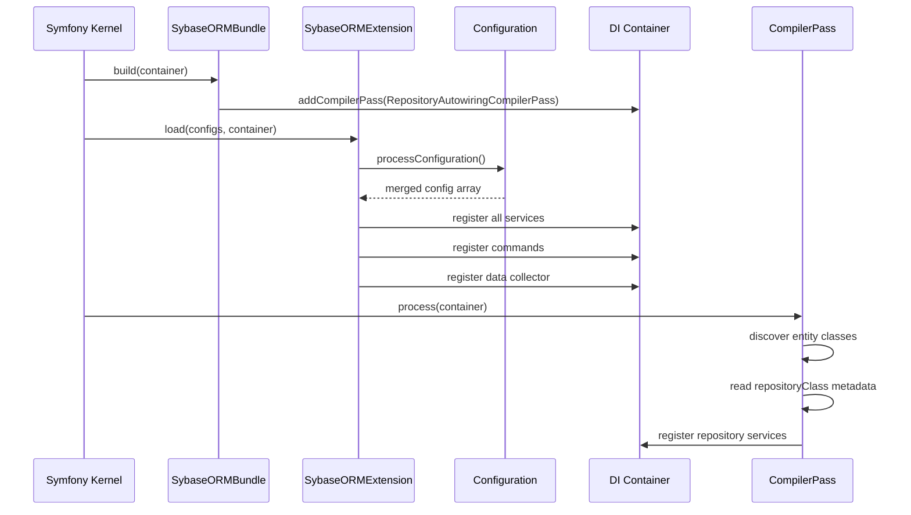

# Manual Técnico — Arquitectura

[← Índice](../README.md) | [Siguiente: Contenedor DI →](02-contenedor-di.md)

---

## Visión General

El `sybase-orm-bundle` es una capa de integración entre el framework Symfony y la librería `shedeza/sybase-orm`. Su responsabilidad principal es registrar los servicios del ORM en el contenedor de inyección de dependencias de Symfony y proporcionar herramientas de desarrollo (comandos, profiler).

## Diagrama de Componentes



## Capas de la Arquitectura

### Capa 1: Bundle (Integración Symfony)

| Componente | Responsabilidad |
|------------|----------------|
| `SybaseORMBundle` | Punto de entrada del bundle, registra compiler passes |
| `SybaseORMExtension` | Procesa configuración y registra servicios en el DI |
| `Configuration` | Define el árbol de configuración válido |
| `RepositoryAutowiringCompilerPass` | Auto-registra repositorios custom |
| Commands (6) | Herramientas CLI para desarrollo y operación |
| `SybaseQueryCollector` | Recolecta datos de queries para el profiler |

### Capa 2: ORM Core (shedeza/sybase-orm)

| Componente | Responsabilidad |
|------------|----------------|
| `EntityManager` | Fachada principal para operaciones CRUD |
| `EntityManagerRegistry` | Gestiona múltiples EntityManagers |
| `UnitOfWork` | Acumula cambios y ejecuta transacciones |
| `ConnectionManager` | Gestiona conexiones PDO a Sybase ASE |
| `MetadataReader` | Lee y cachea metadatos de atributos PHP |
| `Hydrator` | Convierte rows de BD a objetos PHP |
| `SybaseDialect` | Genera SQL específico para Sybase ASE |
| `TypeCaster` | Convierte tipos PHP ↔ tipos de BD |
| `IdentityMap` | Mantiene instancias únicas por entidad |
| `CacheManager` | Gestiona caché de identity map y segundo nivel |
| `ProxyGenerator` | Genera clases proxy para lazy loading |
| `MigrationManager` | Gestiona archivos y ejecución de migraciones |
| `HookDispatcher` | Sistema de hooks/eventos del ORM |

### Capa 3: Infraestructura

| Componente | Responsabilidad |
|------------|----------------|
| Sybase ASE | Sistema de base de datos relacional |
| PDO (pdo_dblib) | Driver PHP para conexión vía FreeTDS |
| FreeTDS | Librería de sistema para protocolo TDS |

## Dependencias entre Paquetes

```mermaid
graph LR
    A[shedeza/sybase-orm-bundle] --> B[shedeza/sybase-orm ^3.0]
    A --> C[symfony/framework-bundle ^6.0|^7.0]
    A --> D[symfony/console ^6.0|^7.0]
    A --> E[symfony/http-foundation ^6.0|^7.0]
    A --> F[symfony/http-kernel ^6.0|^7.0]
    B --> G[ext-pdo_dblib]
    B --> H[ext-pdo]
```

## Flujo de Boot del Bundle



## Principios de Diseño

1. **Separation of Concerns**: El bundle NO contiene lógica de ORM; solo integra la librería con Symfony.
2. **Interface-Based**: Todos los servicios se registran con aliases de interfaz para facilitar autowiring y testing.
3. **Per-Connection Isolation**: Cada conexión tiene su propio set de servicios (IdentityMap, UoW, Cache, EM).
4. **Fail-Safe Boot**: Si no hay conexión configurada, el bundle no registra servicios (permite `cache:clear` durante instalación).
5. **Compile-Time Discovery**: El compiler pass descubre repositorios en tiempo de compilación, no en runtime.

---

[← Índice](../README.md) | [Siguiente: Contenedor DI →](02-contenedor-di.md)
