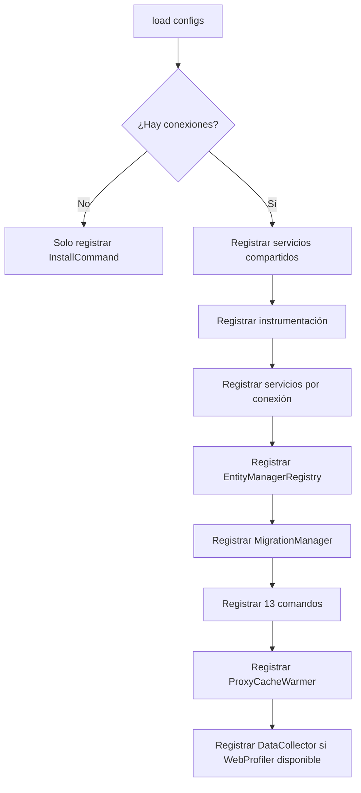

# Manual Técnico — Contenedor de Inyección de Dependencias

[← Anterior: Arquitectura](01-arquitectura.md) | [Índice](../README.md) | [Siguiente: Configuración Interna →](03-configuracion-interna.md)

---

## SybaseORMExtension

La clase `SybaseORMExtension` es el corazón del bundle. Implementa `Symfony\Component\DependencyInjection\Extension\Extension` y se encarga de registrar todos los servicios del ORM en el contenedor.

### Flujo de Registro



### Normalización de Conexiones

El Extension normaliza la configuración de conexiones antes de procesar:

```php
// Si se usa 'connection' (singular), se trata como 'connections.default'
$connections = $config['connections'] ?? [];
if (!empty($config['connection'])) {
    $connections = array_merge(['default' => $config['connection']], $connections);
}
```

Esto permite que el usuario use la sintaxis simplificada (`connection:`) o la avanzada (`connections:`).

## Servicios Compartidos (Singleton)

Estos servicios se registran una vez y son compartidos por todas las conexiones:

| Servicio | Interfaz (alias) | Descripción |
|----------|-------------------|-------------|
| `SybaseDialect` | `DialectInterface` | Generador de SQL para Sybase |
| `TypeCaster` | `TypeCasterInterface` | Conversión de tipos |
| `MetadataReader` | `MetadataReaderInterface` | Lectura de metadatos de entidades |
| `HookDispatcher` | — | Despacho de hooks/eventos |
| `ProxyGenerator` | — | Generación de clases proxy |
| `InstrumentationCollector` | `OrmInstrumentationInterface` | Instrumentación nativa del ORM (dev) |
| `NullInstrumentation` | `OrmInstrumentationInterface` | No-op en producción |

## Servicios Por Conexión

Para cada conexión configurada, se registra un conjunto completo de servicios con sufijo `.nombre`:

| Service ID | Clase | Dependencias principales |
|------------|-------|--------------------------|
| `sybase_orm.connection_manager.{name}` | `ConnectionManager` | Config, Logger, OrmInstrumentationInterface |
| `sybase_orm.identity_map.{name}` | `IdentityMap` | — |
| `sybase_orm.cache_manager.{name}` | `CacheManager` | IdentityMap, RedisCacheAdapter, Logger, failure_threshold, cooldown_seconds |
| `sybase_orm.hydrator.{name}` | `Hydrator` | MetadataReader, TypeCaster, IdentityMap, UoW, ProxyGenerator |
| `sybase_orm.unit_of_work.{name}` | `UnitOfWork` | ConnectionManager, MetadataReader, Dialect, TypeCaster, IdentityMap, HookDispatcher |
| `sybase_orm.entity_manager.{name}` | `EntityManager` | ConnectionManager, MetadataReader, Dialect, TypeCaster, Hydrator, UoW, IdentityMap, HookDispatcher, CacheManager, Logger |

### Servicios Redis (cuando cache.adapter = 'redis')

| Service ID | Clase | Descripción |
|------------|-------|-------------|
| `sybase_orm.redis.{name}` | `Redis` | Conexión PHP Redis |
| `sybase_orm.cache_adapter.{name}` | `RedisCacheAdapter` | Adaptador de caché con prefijo |

### Aliases de la Conexión Principal

La primera conexión definida (generalmente `default`) recibe aliases directos a las interfaces:

```php
if ($isFirst) {
    $container->setAlias(ConnectionManagerInterface::class, 'sybase_orm.connection_manager.' . $name);
    $container->setAlias(EntityManagerInterface::class, 'sybase_orm.entity_manager.' . $name);
    $container->setAlias(CacheManagerInterface::class, 'sybase_orm.cache_manager.' . $name);
    // ... etc.
}
```

Esto permite autowiring directo con las interfaces sin especificar conexión.

## ConnectionManager: Factory Method con Instrumentación

Cuando se usa `url` en la configuración, el ConnectionManager se crea via factory method. Desde v2.0, recibe `OrmInstrumentationInterface` como argumento nativo:

```php
$connDef = new Definition(ConnectionManager::class);
$connDef->setFactory([SybaseORMExtension::class, 'createConnectionManagerFromUrl']);
$connDef->setArguments([
    $connectionConfig['url'],
    $connectionConfig['charset_conversion'] ?? false,
    $loggerRef,
    $instrumentationRef,  // OrmInstrumentationInterface
]);
```

El método factory:

```php
public static function createConnectionManagerFromUrl(
    string $url,
    bool $charsetConversion = false,
    ?LoggerInterface $logger = null,
    ?OrmInstrumentationInterface $instrumentation = null,
): ConnectionManager {
    $config = ConnectionUrlParser::parse($url);
    if ($charsetConversion) {
        $config['charset_conversion'] = true;
    }
    return new ConnectionManager($config, $logger, $instrumentation);
}
```

## CacheManager con Circuit Breaker

El `CacheManager` recibe los parámetros de circuit breaker directamente:

```php
$cacheDef = new Definition(CacheManager::class, [
    new Reference('sybase_orm.identity_map' . $suffix),
    $secondLevelRef,        // RedisCacheAdapter o null
    $loggerRef,
    $cacheConfig['failure_threshold'] ?? 3,
    $cacheConfig['cooldown_seconds'] ?? 60,
]);
```

## Redis Connection Factory

La conexión Redis se crea mediante un factory method que soporta tanto parámetros individuales como DSN:

```php
public static function createRedisConnection(
    string $host = '127.0.0.1',
    int $port = 6379,
    ?string $password = null,
    int $database = 0,
    float $timeout = 2.0,
    ?string $dsn = null,
): Redis {
    $redis = new Redis();
    if ($dsn !== null) {
        $parts = parse_url($dsn);
        $host = $parts['host'] ?? $host;
        $port = $parts['port'] ?? $port;
        // ...
    }
    $redis->connect($host, $port, $timeout);
    // auth + select...
    return $redis;
}
```

## EntityManagerRegistry

El Registry gestiona todos los EntityManagers y permite acceso por nombre:

```php
$registryDef = new Definition(EntityManagerRegistry::class);
$managerRefs = [];
foreach ($managerServiceIds as $name => $serviceId) {
    $managerRefs[$name] = new Reference($serviceId);
}
$registryDef->setArguments([$managerRefs, array_key_first($connections)]);
```

## RepositoryAutowiringCompilerPass

Este compiler pass se ejecuta después de que todos los bundles han cargado sus servicios y auto-registra repositorios custom.

### Algoritmo

```
1. Verificar que EntityManagerRegistry está registrado
2. Obtener entity_directories del parámetro del contenedor
3. Instanciar MetadataReader temporal (sin caché de archivo)
4. Descubrir entidades con EntityDiscovery
5. Para cada entidad con repositoryClass:
   a. Si el repositorio ya está registrado → skip
   b. Crear Definition con factory: EntityManagerRegistry::getRepository($entityClass)
   c. Registrar en el contenedor
6. Limpiar caché de memoria estática
```

### Código relevante

```php
$repoDef = new Definition($metadata->repositoryClass);
$repoDef->setFactory([new Reference(EntityManagerRegistry::class), 'getRepository']);
$repoDef->setArguments([$entityClass]);
$repoDef->setPublic(false);
$repoDef->setAutowired(false);

$container->setDefinition($metadata->repositoryClass, $repoDef);
```

## Hydrator: Circular Dependency

El `Hydrator` tiene una dependencia circular con `EntityManager` (necesita el EM para hidratar relaciones lazy). Esto se resuelve con setter injection:

```php
$hydDef->addMethodCall('setEntityManager', [
    new Reference('sybase_orm.entity_manager' . $suffix)
]);
```

## Registro de Comandos (13 comandos)

El bundle registra 13 comandos:

- **Bundle-specific** (implementación propia): `sybase:install`, `sybase:proxy:generate`
- **ORM nativos** (adaptados via `OrmCommandAdapter`): los 11 restantes

Los comandos nativos del ORM (shedeza/sybase-orm ^3.6) se adaptan a la consola de Symfony mediante `OrmCommandAdapter`:

```php
private function registerOrmCommandAdapter(
    ContainerBuilder $container,
    string $serviceId,
    string $symfonyName,
    string $innerServiceId
): void {
    $adapterDef = new Definition(OrmCommandAdapter::class, [
        new Reference($innerServiceId),
        $symfonyName,
    ]);
    $adapterDef->addTag('console.command', ['command' => $symfonyName]);
    $container->setDefinition($serviceId, $adapterDef);
}
```

## Parámetros del Contenedor

El bundle registra estos parámetros para uso de los comandos:

| Parámetro | Valor |
|-----------|-------|
| `sybase_orm.entity_directories` | Array de directorios de entidades |
| `sybase_orm.proxy_directory` | Ruta del directorio de proxies |
| `sybase_orm.migrations_directory` | Ruta del directorio de migraciones |

## Fail-Safe: Sin Conexión Configurada

Si no hay ninguna conexión configurada, el Extension retorna temprano registrando solo `InstallCommand`:

```php
if (empty($connections)) {
    $installDef = new Definition(InstallCommand::class, ['%kernel.project_dir%']);
    $installDef->addTag('console.command');
    $container->setDefinition(InstallCommand::class, $installDef);
    return;
}
```

Esto permite que `php bin/console cache:clear` funcione después de instalar el bundle pero antes de configurar la conexión.

---

[← Anterior: Arquitectura](01-arquitectura.md) | [Índice](../README.md) | [Siguiente: Configuración Interna →](03-configuracion-interna.md)
