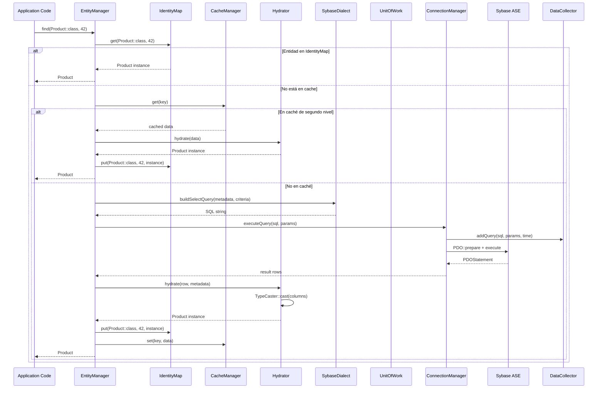
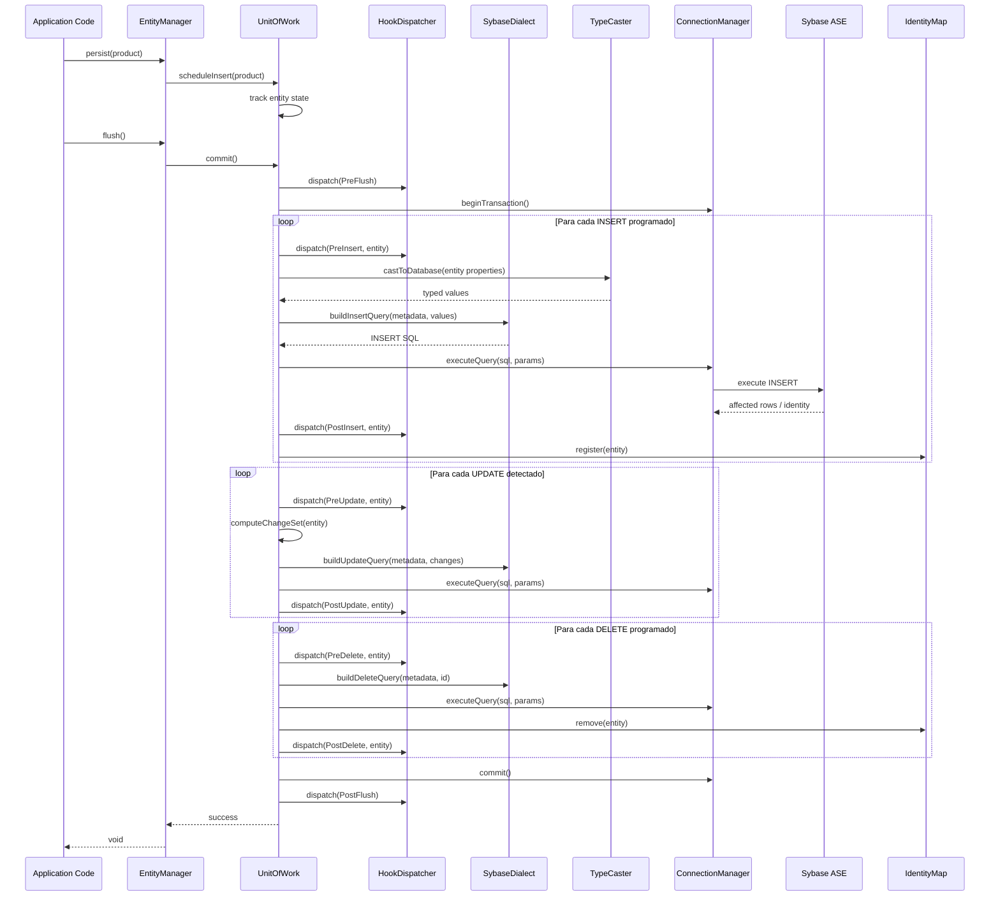
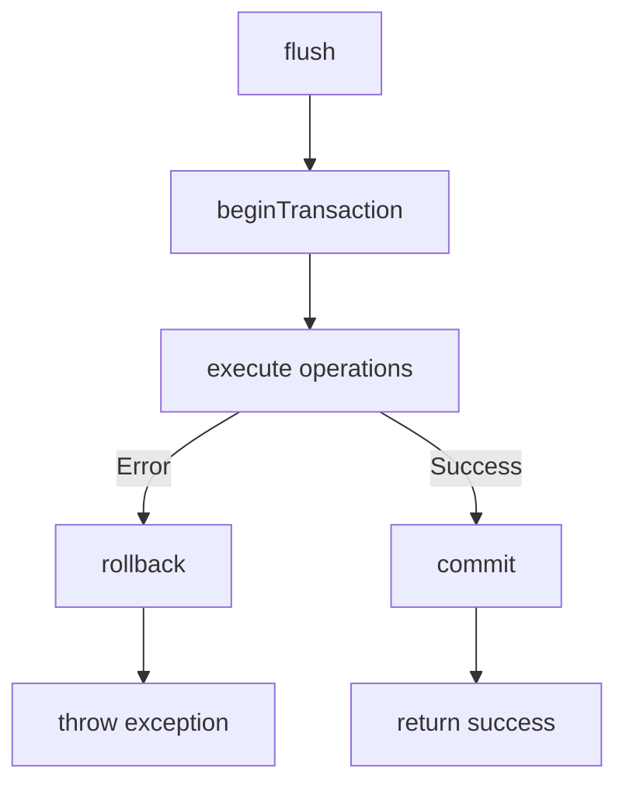

# Manual Técnico — Ciclo de Vida de una Consulta

[← Anterior: Configuración Interna](03-configuracion-interna.md) | [Índice](../README.md) | [Siguiente: Profiler →](05-profiler.md)

---

## Flujo de una Operación de Lectura (find)

## Flujo de una Operación de Escritura (persist + flush)

## Componentes Clave en el Flujo

### ConnectionManager

Gestiona la conexión PDO subyacente:
- Lazy connection (se conecta en la primera query)
- Soporte de conexiones persistentes
- Transacciones (begin, commit, rollback)
- Conversión de charset si está habilitada

### SybaseDialect

Genera SQL específico para Sybase ASE:
- Sintaxis `TOP n` en lugar de `LIMIT`
- Funciones de fecha/hora específicas de ASE
- Escape de identificadores con corchetes `[nombre]`
- Tipos de dato Sybase (varchar, datetime, numeric, etc.)

### TypeCaster

Convierte entre tipos PHP y tipos de base de datos:
- `int` ↔ `INTEGER`
- `float` ↔ `NUMERIC/DECIMAL`
- `string` ↔ `VARCHAR/CHAR`
- `bool` ↔ `BIT/TINYINT`
- `\DateTimeInterface` ↔ `DATETIME`
- Tipos custom extensibles

### Hydrator

Transforma rows de resultado en objetos PHP:
- Lee metadatos para mapear columnas → propiedades
- Aplica TypeCaster para conversión de tipos
- Gestiona relaciones lazy via ProxyGenerator
- Registra entidades en el IdentityMap
- Resuelve embedded objects (columnas con dot notation)

### HookDispatcher

Despacha eventos en puntos clave del ciclo de vida:
- `PreFlush`, `PostFlush`
- `PreInsert`, `PostInsert`
- `PreUpdate`, `PostUpdate`
- `PreDelete`, `PostDelete`
- Permite lógica custom (auditoría, validación, etc.)

## Manejo de Errores

Si una operación falla durante `flush()`:

El UnitOfWork ejecuta rollback automático si cualquier operación falla, manteniendo la consistencia de la base de datos.

---

[← Anterior: Configuración Interna](03-configuracion-interna.md) | [Índice](../README.md) | [Siguiente: Profiler →](05-profiler.md)
