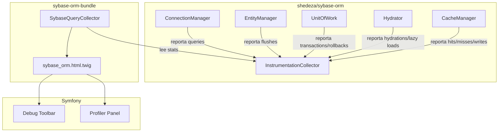
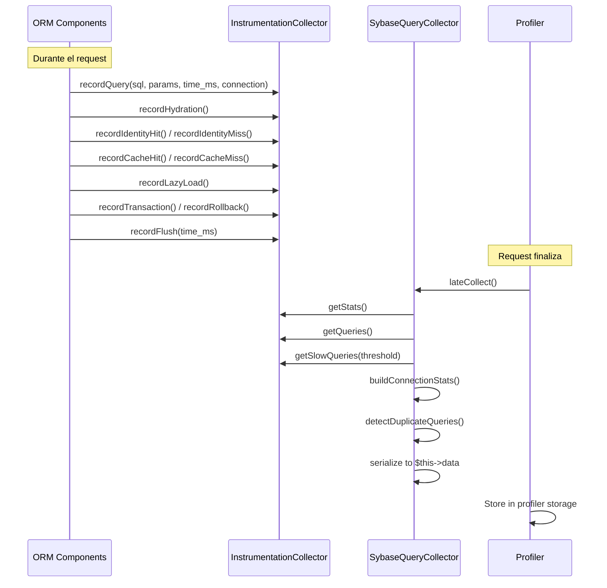

# Manual Técnico — Profiler

[← Anterior: Ciclo de Vida](04-ciclo-vida-consulta.md) | [Índice](../README.md) | [Siguiente: Extensión →](06-extension.md)

---

## Arquitectura de Instrumentación (v2.0+)

Desde la versión 2.0, el bundle utiliza **instrumentación nativa del ORM** en lugar de decoradores. El ORM (shedeza/sybase-orm ^3.6) expone un `InstrumentationCollector` al que cada componente reporta métricas directamente. Esto elimina la necesidad de decorar el `ConnectionManager` y reduce el overhead en desarrollo.

### Diagrama de Componentes



## SybaseQueryCollector

El `SybaseQueryCollector` implementa `DataCollector` y `LateDataCollectorInterface`. Usa `lateCollect()` para leer los datos acumulados del `InstrumentationCollector` al final del request.

### Clase y Registro

```php
namespace SybaseORM\Bundle\DataCollector;

final class SybaseQueryCollector extends DataCollector implements LateDataCollectorInterface
{
    public function __construct(InstrumentationCollector $instrumentation)
    {
        $this->instrumentation = $instrumentation;
    }
}
```

Se registra en el Extension con el tag `data_collector`:

```php
$collectorDef = new Definition(SybaseQueryCollector::class, [
    new Reference(InstrumentationCollector::class),
]);
$collectorDef->addTag('data_collector', [
    'template' => '@SybaseORM/Collector/sybase_orm.html.twig',
    'id' => 'sybase_orm',
]);
```

## Instrumentación vs Decoradores

| Aspecto | Decoradores (v1.x) | Instrumentación nativa (v2.0+) |
|---------|--------------------|---------------------------------|
| Mecanismo | Wrapper alrededor de ConnectionManager | ORM reporta internamente a InstrumentationCollector |
| Overhead | Indirection + method delegation | Llamadas directas a métodos de recolección |
| Métricas disponibles | Solo queries (SQL, params, time) | Queries, hydrations, identity map, lazy loads, caché, transacciones, flush time |
| Producción | Se registra NullDecorator | Se registra `NullInstrumentation` (zero overhead) |
| Configuración | Requiere decorar manualmente | Automático vía DI (detecta WebProfilerBundle) |

## Datos Recolectados

El `lateCollect()` lee los siguientes datos del `InstrumentationCollector`:

| Campo | Tipo | Descripción |
|-------|------|-------------|
| `queries` | array | Lista de queries con SQL, params, time_ms, connection |
| `query_count` | int | Número total de queries |
| `total_time` | float | Tiempo total de ejecución de queries (ms) |
| `total_flush_time` | float | Tiempo total de flush (ms) |
| `hydrations` | int | Número de hidrataciones realizadas |
| `collections` | int | Número de colecciones cargadas |
| `identity_hits` | int | Aciertos en el Identity Map |
| `identity_misses` | int | Fallos en el Identity Map |
| `cache_hits` | int | Aciertos en caché de segundo nivel |
| `cache_misses` | int | Fallos en caché de segundo nivel |
| `cache_writes` | int | Escrituras a la caché de segundo nivel |
| `lazy_loads` | int | Cargas lazy realizadas |
| `flushes` | int | Número de flushes ejecutados |
| `transactions` | int | Transacciones iniciadas |
| `rollbacks` | int | Rollbacks ejecutados |
| `connection_stats` | array | Estadísticas por conexión (queries, time) |
| `duplicate_queries` | array | Queries duplicadas detectadas |
| `slow_queries` | array | Queries que superan umbral (100ms) |

## API Pública (Getters para Templates)

```php
public function getQueryCount(): int
public function getTotalTime(): float
public function getTotalFlushTime(): float
public function getQueries(): array
public function getHydrations(): int
public function getCollections(): int
public function getIdentityHits(): int
public function getIdentityMisses(): int
public function getCacheHits(): int
public function getCacheMisses(): int
public function getCacheWrites(): int
public function getLazyLoads(): int
public function getFlushes(): int
public function getTransactions(): int
public function getRollbacks(): int
public function getConnectionStats(): array
public function getDuplicateQueries(): array
public function getSlowQueries(): array
public function hasWarnings(): bool
```

### hasWarnings()

Retorna `true` si se detectan posibles problemas de rendimiento:
- Queries duplicadas
- Queries lentas (> 100ms)
- Más de 5 lazy loads (posible N+1)
- Rollbacks ejecutados

## Integración con la Toolbar

La debug toolbar muestra un resumen compacto:
- Número de queries y tiempo total
- Indicador visual de warnings si los hay

Al hacer clic, el panel del profiler muestra:
- Resumen de métricas (hydrations, identity map, cache, transactions, flush time)
- Tabla detallada con cada query (SQL, params con VarDumper, tiempo, conexión)
- Sección de queries duplicadas
- Sección de queries lentas
- Estadísticas por conexión

## Diagrama de Flujo



## Registro de Instrumentación en el Extension

```php
private function registerInstrumentation(ContainerBuilder $container): void
{
    $profilerAvailable = class_exists('Symfony\\Bundle\\WebProfilerBundle\\WebProfilerBundle');

    if ($profilerAvailable) {
        // InstrumentationCollector: el ORM escribe datos aquí
        $instrDef = new Definition(InstrumentationCollector::class);
        $container->setDefinition(InstrumentationCollector::class, $instrDef);

        // DataCollector: lee desde InstrumentationCollector para el profiler
        $collectorDef = new Definition(SybaseQueryCollector::class, [
            new Reference(InstrumentationCollector::class),
        ]);
        $collectorDef->addTag('data_collector', [...]);
        $container->setDefinition(SybaseQueryCollector::class, $collectorDef);

        // Alias para inyección en ConnectionManager
        $container->setAlias(OrmInstrumentationInterface::class, InstrumentationCollector::class);
    } else {
        // Producción: NullInstrumentation (zero overhead)
        $nullDef = new Definition(NullInstrumentation::class);
        $container->setDefinition(NullInstrumentation::class, $nullDef);
        $container->setAlias(OrmInstrumentationInterface::class, NullInstrumentation::class);
    }
}
```

## Inyección de Instrumentación en ConnectionManager

El `ConnectionManager` recibe `OrmInstrumentationInterface` como argumento de constructor. No se necesita decorar el servicio:

```php
$connDef->setFactory([self::class, 'createConnectionManagerFromUrl']);
$connDef->setArguments([
    $connectionConfig['url'],
    $connectionConfig['charset_conversion'] ?? false,
    $loggerRef,
    $instrumentationRef,  // OrmInstrumentationInterface
]);
```

## Consideraciones de Rendimiento

- En producción (sin WebProfilerBundle), se usa `NullInstrumentation`: todas las llamadas de registro son no-op
- En desarrollo, `InstrumentationCollector` acumula en arrays en memoria (overhead mínimo)
- `lateCollect()` se ejecuta después del response, no afecta al tiempo de respuesta del usuario
- `reset()` limpia datos entre requests en entornos persistentes (Swoole, RoadRunner)

---

[← Anterior: Ciclo de Vida](04-ciclo-vida-consulta.md) | [Índice](../README.md) | [Siguiente: Extensión →](06-extension.md)
