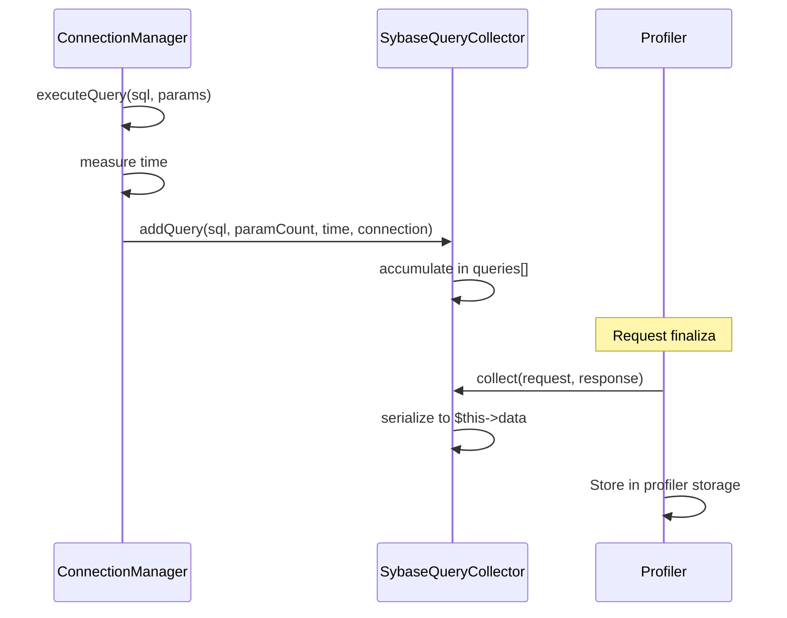

# Manual Técnico — Profiler

[← Anterior: Ciclo de Vida](04-ciclo-vida-consulta.md) | [Índice](../README.md) | [Siguiente: Extensión →](06-extension.md)

---

## SybaseQueryCollector

El `SybaseQueryCollector` es un `DataCollector` de Symfony que recolecta información sobre las queries ejecutadas durante un request HTTP. Se muestra en la barra de debug y el profiler web.

## Clase y Registro

```php
namespace SybaseORM\Bundle\DataCollector;

final class SybaseQueryCollector extends DataCollector
{
    // ...
}
```

Se registra en el Extension con el tag `data_collector`:

```php
$collectorDef = new Definition(SybaseQueryCollector::class);
$collectorDef->addTag('data_collector', ['template' => null, 'id' => 'sybase_orm']);
$collectorDef->setPublic(false);
$container->setDefinition(SybaseQueryCollector::class, $collectorDef);
```

## Datos Recolectados

Cada query registrada contiene:

| Campo | Tipo | Descripción |
|-------|------|-------------|
| `sql` | string | La sentencia SQL ejecutada |
| `params` | int | Número de parámetros bound |
| `time` | float | Tiempo de ejecución en milisegundos |
| `connection` | string | Nombre de la conexión utilizada |

## API Pública

### addQuery()

Registra una query ejecutada. Llamado internamente por el ConnectionManager cuando el collector está presente:

```php
public function addQuery(
    string $sql,
    int $paramCount,
    float $timeMs,
    string $connection = 'default'
): void
```

### collect()

Método llamado por Symfony al final del request. Consolida los datos para serialización:

```php
public function collect(Request $request, Response $response, ?\Throwable $exception = null): void
{
    $this->data = [
        'queries' => $this->queries,
        'query_count' => count($this->queries),
        'total_time' => $this->totalTime,
    ];
}
```

### Getters para templates

```php
public function getQueryCount(): int     // Número total de queries
public function getTotalTime(): float    // Tiempo total en ms
public function getQueries(): array      // Array de todas las queries
```

### reset()

Limpia los datos entre requests (importante para long-running processes):

```php
public function reset(): void
{
    $this->data = [];
    $this->queries = [];
    $this->totalTime = 0.0;
}
```

## Integración con la Toolbar

El collector se identifica con el id `sybase_orm` y muestra en la debug toolbar de Symfony:

- Número de queries ejecutadas
- Tiempo total de ejecución

Al hacer clic, el panel del profiler muestra:
- Tabla detallada con cada query
- SQL con syntax highlighting
- Tiempo individual de cada query
- Conexión utilizada

## Diagrama de Flujo



## Consideraciones de Rendimiento

- El collector solo accumula datos en memoria; no añade overhead significativo
- En producción, el profiler normalmente está deshabilitado, por lo que el collector no recibe datos
- El método `reset()` asegura limpieza entre requests en modo service-container persistente (como Swoole/RoadRunner)

## Personalización

Para crear un template custom para el panel del profiler, registra el collector con un template Twig:

```php
$collectorDef->addTag('data_collector', [
    'template' => '@SybaseORM/Collector/sybase_orm.html.twig',
    'id' => 'sybase_orm',
]);
```

El template tendría acceso a `collector.queryCount`, `collector.totalTime`, y `collector.queries`.

---

[← Anterior: Ciclo de Vida](04-ciclo-vida-consulta.md) | [Índice](../README.md) | [Siguiente: Extensión →](06-extension.md)
